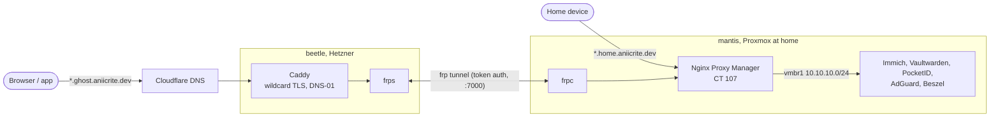
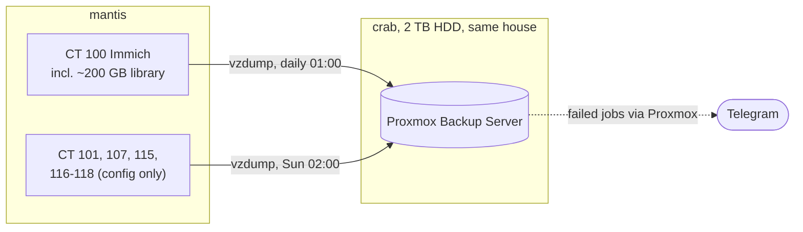
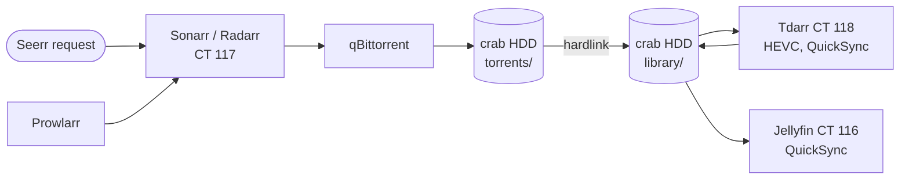

# Homelab

Configuration for the machines I run at home and on rented servers: a Proxmox box with self-hosted services, two VPS machines, and my desktop. Every stack in this repository is a copy of the live configuration with secrets replaced by placeholders, so the setup can be rebuilt from here.

## Machines

| Machine | Hardware / provider | Role | Folder |
| --- | --- | --- | --- |
| mantis | Proxmox VE 9 on a mini PC (Intel i5-8500T, 24 GB RAM, 512 GB NVMe + 512 GB SATA SSD), at home behind NAT | LXC containers for photos, passwords, SSO, DNS, reverse proxy, monitoring and backups | [`machines/mantis`](machines/mantis) |
| beetle | Hetzner VPS, Ubuntu 24.04 | Public entry point: Caddy (TLS), frp tunnel server, NetBird, personal sites | [`machines/beetle`](machines/beetle) |
| vultr | Vultr VPS, Ubuntu 26.04 | Tailscale peer relay, RustDesk server | [`machines/vultr`](machines/vultr) |
| crab | Ubuntu 24.04 desktop, on 24x7 | Proxmox Backup Server, SMB media share, Ollama, Penpot | [`machines/crab`](machines/crab) |

Short-lived experiments run on AWS and are torn down afterwards; nothing from them is kept here.

## Network

Home services have two names each under `aniicrite.dev`: `<service>.ghost.aniicrite.dev` from the internet and `<service>.home.aniicrite.dev` on the home network. Both land on Nginx Proxy Manager, which forwards to the containers over an internal bridge.



- The home network has no open ports. frpc in CT 107 keeps an outbound tunnel to frps on beetle; Caddy terminates TLS for `*.ghost.aniicrite.dev` and passes the connection through the tunnel to NPM.
- NPM holds one Let's Encrypt wildcard certificate for `*.ghost` and `*.home`, issued with the Cloudflare DNS challenge.
- Each container has a LAN address on `vmbr0` and an internal address `10.10.10.<CT id>` on `vmbr1`. NPM reaches services only on `vmbr1`; the Proxmox firewall filters the LAN side.
- Machines reach each other over Tailscale; vultr is a peer relay for connections that cannot go direct.

## Services

| Service | Where | Folder |
| --- | --- | --- |
| Immich (photos, Intel QuickSync) | mantis CT 100 | [`immich`](machines/mantis/immich) |
| Vaultwarden (passwords, Google SSO) | mantis CT 101 | [`vaultwarden`](machines/mantis/vaultwarden) |
| AdGuard Home (DNS for the home network) | mantis CT 103 | [`mantis`](machines/mantis) |
| Nginx Proxy Manager, frpc, tinyauth, cup | mantis CT 107 | [`nginxproxymanager`](machines/mantis/nginxproxymanager) |
| Beszel hub (monitoring) | mantis CT 109 | [`beszel`](machines/mantis/beszel) |
| PocketID (OIDC for Immich, tinyauth, Proxmox) | mantis CT 115 | [`pocketid`](machines/mantis/pocketid) |
| Jellyfin (media, Intel QuickSync) | mantis CT 116 | [`jellyfin`](machines/mantis/jellyfin) |
| Sonarr, Radarr, Prowlarr, qBittorrent, Bazarr, Seerr (automatic downloads) | mantis CT 117 | [`arr`](machines/mantis/arr) |
| Tdarr (converts the library to HEVC) | mantis CT 118 | [`tdarr`](machines/mantis/tdarr) |
| Caddy, frps, NetBird, aliasvault | beetle | [`beetle`](machines/beetle) |
| RustDesk server, Tailscale relay | vultr | [`vultr`](machines/vultr) |

## Backups



- Only the critical containers are backed up: Immich with its photo library every night; Vaultwarden, NPM, PocketID and the configuration of the media containers every Sunday.
- Proxmox Backup Server on crab deduplicates the backups, so a nightly Immich backup only stores new photos. It keeps 7 daily, 4 weekly and 6 monthly snapshots. There is no offsite copy.
- Movies and series are not backed up. They live only on crab's HDD and can be downloaded again.

## Media



- Crab exports `/mnt/data/media` over NFS to mantis; CT 116-118 mount it as `/data`. The media tree is capped at 1.2 TB so it cannot fill the disk the backups use.
- Sonarr and Radarr grab at most 1080p and prefer releases that are already HEVC. Downloads and the library are on the same filesystem, so an import is a hardlink, not a copy.
- Tdarr converts what is left to HEVC 10-bit with QuickSync between 03:00 and 09:00, keeps English, Hindi and the original-language tracks, and adds an AAC stereo track.
- Jellyfin plays it, converting on the fly with QuickSync for devices that need it.

## Monitoring and alerts

Beszel agents on all four machines report to the hub in CT 109 over an outbound WebSocket, including S.M.A.R.T. data for the physical disks. Alerts go to a Telegram bot:

| Source | Alerts |
| --- | --- |
| Beszel | machine offline 2 min, disk > 85%, memory > 90%, CPU > 90%, temperature > 80 °C, S.M.A.R.T. failure |
| Proxmox | any error-severity event, including failed vzdump jobs |
| Proxmox Backup Server (crab) | any error-severity event: failed prune, garbage collection or verify |

## Rebuilding

Each machine folder has a `readme.md` with the install order and the commands used. General rules:

1. Files ending in `.example` or `.template` hold placeholders (`<VALUE>`, `${VAR}`, `{{ .Envs.VAR }}`). Copy them without the suffix on the host and fill in the values.
2. Scripts (`*.sh`) take secrets from environment variables, never from arguments stored in the repo.
3. Order: beetle (DNS, Caddy, frps), then crab (backup disk, PBS, SMB share), then mantis (Proxmox network and firewall, CT 107, the other containers, backups), then vultr.

## Repository layout

```
machines/
├── beetle/     # Hetzner VPS: caddy/, frps/, netbird/, aliasvault/, host/
├── mantis/     # Proxmox: proxmox/ (firewall, backups, notifications) and one folder per container stack
├── vultr/      # rustdesk/, host/
└── crab/       # desktop: backup disk, PBS, SMB share, Beszel agent
.githooks/      # pre-commit and pre-push secret scan (gitleaks)
.github/        # secret scan on GitHub
```

## Keeping secrets out

Real values stay on the hosts in gitignored `.env` files. Three layers stop them from reaching Git:

- `.gitignore` excludes secret-bearing file types (`.env`, keys, certificates, Terraform state, databases).
- `.githooks/pre-commit` and `.githooks/pre-push` run [gitleaks](https://github.com/gitleaks/gitleaks) with the rules in `.gitleaks.toml` (defaults plus public IPv4 addresses, literal credentials and secret-bearing file names). They refuse to run without gitleaks.
- `.github/workflows/secret-scan.yml` scans the full history on every push.

Enable the hooks once per clone, or globally:

```bash
git config core.hooksPath .githooks        # this clone
git config --global core.hooksPath .githooks # every clone on this machine
```
